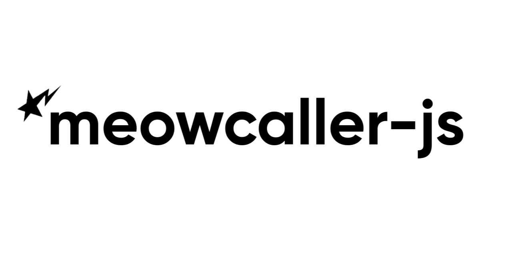

# meowcaller-js

[](https://www.npmjs.com/package/meowcaller-js)
[](LICENSE)
[](https://github.com/bencodess/meowcaller-js/stargazers)

<p align="center">
  
</p>

A JavaScript port of [meowcaller](https://github.com/purpshell/meowcaller) — WhatsApp VoIP library for [Baileys](https://github.com/WhiskeySockets/Baileys). Pure JavaScript, no native bindings, runs wherever Node.js does.


## Status

**Experimental.** Signaling works. Media relay (DTLS/UDP → STUN → SRTP) is still waiting on Node.js native DTLS or a WebRTC bridge. Check the [implementation table](#implementation-status) for details.

## Usage

```js
import { makeWASocket, useMultiFileAuthState } from '@whiskeysockets/baileys';
import { Client, SinkFunc, SourceFunc } from 'meowcaller-js';

const { state, saveCreds } = await useMultiFileAuthState('auth_info');
const wa = makeWASocket({ auth: state, printQRInTerminal: true });

const client = new Client(wa);
client.connect();

client.onIncomingCall((call) => {
  call.onStateChange((phase) => console.log('phase:', phase));
  call.onEnd((reason) => console.log('ended:', reason));
  call.receive(SinkFunc((frame) => console.log('audio frame', frame.length)));
  call.play(SourceFunc(async () => null));
  call.answer();
});

// Place an outbound call:
// const call = await client.call({}, '+15551234567');
// console.log(client.listCalls());
```

## API

### `Client`
- `new Client(wa, opts?)` — wrap a connected `Baileys` socket
- `client.connect()` — install call event handlers (call before WA connects)
- `client.call(ctx, target)` — place an outbound call
- `client.onIncomingCall(fn)` — handle inbound offers
- `client.listCalls()` / `client.getCall(id)` — inspect live calls from the registry

### `Call`
- `call.id()` / `call.peer()` / `call.state()`
- `call.answer()` / `call.reject()` / `call.hangup()`
- `call.subscribe(player)` / `call.play(source)` / `call.receive(sink)`
- `call.receiveVideo(sink)` / `call.sendVideo(annexB)`
- `call.onReady(fn)` / `call.onEnd(fn)` / `call.onStateChange(fn)`

### Audio
- `PCMStream(readable)` — raw s16le PCM → float32 frames
- `WAVFile(path)` — RIFF/WAV file stream
- `SourceFunc(provider)` — simple audio source adapter for custom frame generators
- `SinkFunc(fn)` — callback-based audio sink

### Video
- `AnnexBRecorder(path)` — record H.264 to .h264 file
- `VideoSinkFunc(fn)` — callback-based video sink

## Implementation Status

| Feature | Status |
|---------|--------|
| Outbound calls | Signal path ported |
| Inbound calls | Signal path ported |
| Audio calls | Signaling + media relay via DTLS/SCTP/DataChannel |
| Video calls | Signaling + depacketizer ported |
| MLow codec | Stub — needs WASM port |
| Opus codec | Planned |
| DTLS → relay | Implemented via `node-datachannel` (libdatachannel) |

## Differences from meowcaller

- **Async/await** instead of goroutines + channels
- **EventEmitter** patterns instead of Go callbacks
- **No unsafe** — no reflection-based monkey-patching
- **No CGO** — pure JavaScript throughout
- Call registry for listing and cleaning up active sessions
- Source/sink adapters for piping audio in and out
- Regression tests, GitHub Actions CI, auto-publish on `v*` tags

## License

MIT
